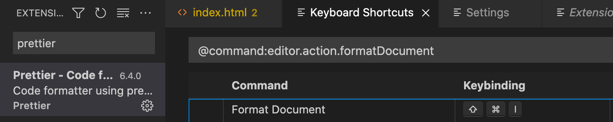

<a href="https://programmers.co.kr/learn/challenges">프로그래머스</a> 챌린지 중 Level 1 맨처음에 해당하는 체육복 챌린지.  


**문제 설명**

점심시간에 도둑이 들어, 일부 학생이 체육복을 도난당했습니다. 다행히 여벌 체육복이 있는 학생이 이들에게 체육복을 빌려주려 합니다. 학생들의 번호는 체격 순으로 매겨져 있어, 바로 앞번호의 학생이나 바로 뒷번호의 학생에게만 체육복을 빌려줄 수 있습니다. 예를 들어, 4번 학생은 3번 학생이나 5번 학생에게만 체육복을 빌려줄 수 있습니다. 체육복이 없으면 수업을 들을 수 없기 때문에 체육복을 적절히 빌려 최대한 많은 학생이 체육수업을 들어야 합니다.

전체 학생의 수 n, 체육복을 도난당한 학생들의 번호가 담긴 배열 lost, 여벌의 체육복을 가져온 학생들의 번호가 담긴 배열 reserve가 매개변수로 주어질 때, 체육수업을 들을 수 있는 학생의 최댓값을 return 하도록 solution 함수를 작성해주세요.


**제한사항** 

전체 학생의 수는 2명 이상 30명 이하입니다.
체육복을 도난당한 학생의 수는 1명 이상 n명 이하이고 중복되는 번호는 없습니다.
여벌의 체육복을 가져온 학생의 수는 1명 이상 n명 이하이고 중복되는 번호는 없습니다.
여벌 체육복이 있는 학생만 다른 학생에게 체육복을 빌려줄 수 있습니다.
여벌 체육복을 가져온 학생이 체육복을 도난당했을 수 있습니다. 이때 이 학생은 체육복을 하나만 도난당했다고 가정하며, 남은 체육복이 하나이기에 다른 학생에게는 체육복을 빌려줄 수 없습니다.

**입출력 예**

<table>
  <thead>
    <tr>
      <th>n	</th>
      <th>lost</th>
      <th>reserve</th>
      <th>return</th>
    </tr>
  </thead>
  <tfoot>
    <tr>
      <td>5	</td>
      <td>[2, 4]</td>
      <td>[1, 3, 5]</td>
      <td> 5</td>
    </tr>
  </tfoot>
  <tbody>
    <tr>
      <td>5</td>
      <td>[2,4]]</td>
      <td>[3]</td>
      <td>4</td>
    </tr>
    <tr>
      <td>3</td>
      <td>[3]</td>
      <td>[1]</td>
      <td>2</td>
    </tr>
  </tbody>
</table>


## 1.사고과정

1. 체육 수업을 들을 수 있는 학생 수 = 총 학생 수 - 체육복이 없는 학생
2. 체육복이 없는 학생을 구하려면 아래를 구한다.
    <br>여벌을 가져왔으나 빌려준 번호 -> 이 번호를 도난당한 리스트에서 제거한다
    <br>도난당했으나 여벌을 입게된 번호 -> 이 번호를 여벌 리스트에서 제거한다
3. 맞는 여벌이 있는지 확인하려면 도난당한 학생번호가 여벌의 +1 -1 범위인지 확인한다

라고 생각하면서 수도코드<strong>(의식의 흐름에 따라 쓰는 가짜코드)</strong>를 짜보았다   

``` javascript
def solution(n, lost, reserve):
     answer = 0    
     for l,r in lost, reserve:
         if | l-r | < 2 
            lost.remove(l)
            reserve.remove(r)
    answer = n - len(l)
    return answer
```

## 2.파이썬 set(집합)자료형의 활용 

인터넷에서 풀이를 찾아보다가 set이라는 것을 활용해서 문제를 풀 수 있다는 것을 알게되었다.

<div class ="message">
  집합(set)은 파이썬 2.3부터 지원하기 시작한 자료형으로, 집합에 관련된 것을 쉽게 처리하기 위해 만든 자료형이다. 
</div>

* 중복을 허용하지 않고
* 순서가 없다

``` python
    new_reserve = list(set(reserve) - set(lost))
    new_lost = list(set(lost) - set(reserve))   
```
new_reserve는 여벌 중에 도난당한 번호를 제외한 진짜 남는 여벌
new_lost는 도난당한 번호 중에 여벌로 갈음되지않은 진짜 없는 번호

3번은 다른 블로그들에 아래와같이 나와있었다.

``` python
for i in new_lost: 
    if i - 1 in new_reserve: 
        answer += 1 
        new_reserve.remove(i - 1) 
    elif i + 1 in new_reserve: 
        answer += 1 
        new_reserve.remove(i + 1) 
```

도난당한 번호의 리스트 중에 여벌의 리스트에 앞 혹은 뒷 번호가 있으면 정답에 1을 더하고 해당 번호를 여벌 리스트에서 제거하고 앞 번호와 뒷 번호를 나누어서 처리했다.

## 3. 모범답안

답을 제출하고 프로그래머에서 다른 사람들이 제출한 답안을 보게되었다. 

``` python
def solution(n, lost, reserve):
_reserve = [r for r in reserve if r not in lost]
_lost = [l for l in lost if l not in reserve]
for r in _reserve:
    f = r - 1
    b = r + 1
    if f in _lost:
        _lost.remove(f)
    elif b in _lost:
        _lost.remove(b)
return n - len(_lost)
```

간결하다.

### 오늘의 단축키
VS code Prettier 패키지의 코드 정리 단축키를 설정했다
cmd + shift + i : 



### 더 공부할 부분

_reserve = [r for r in reserve if r not in lost] 
파이썬 반복문+조건문 써보고 익숙해지기 