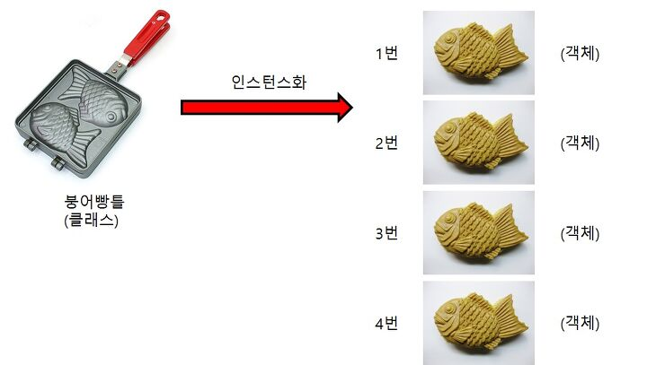
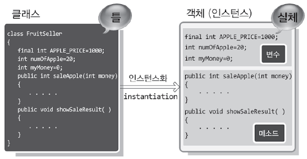

클래스를 살펴보기에 앞서 클래스 안의 함수를 지칭하는 매쏘드를 살펴보자.

## Method  
<div class="message">
클래스 안에 들어있는 함수를 매쏘드라고 부른다 (그래서 클래스로 만든 객체에서만 호출할 수 있다) 
첫번째 파라미터로서 self를 가지고 항상 한 개 이상의 파라미터를 가진다.
</div>      

* 클래스 안의 매쏘드

```python
class Orange:
    def __init__(self):
        #생성자로 사용되는 매직매쏘드 init
        print("Orange Created!")
```    

이렇게 두 개의 __ 언더스코어로 둘러쌓인 매쏘드는 매직매쏘드라고 불리고 객체를 생성하는 것같은 특별한 목적을 위해서 사용된다. \__new__, \__init__ 등이 있다.      
<br>

# Class
<br>
> The object-oriented programming paradigm also addresses the problems that arise in procedural programming by eliminating global state, but instead of storing state in functions, it is stored in objects. In object-oriented programming, classes define a set of objects that can interact with each other. - 'the self-taught programmer' by cory althoff    
<div class="message">
클래스는 다른 것들과 상호작용할 수 있는 객체들의 모음이다.<br>
클래스라는 것을 나타내기 위해서 첫 글자는 대문자를 사용하는 것이 관례이고 인스턴스화(클래스를 객체로 만드는 과정) 되어야한다. 
</div>  

<br>
    
<br>

* 다른 색과 무게의 오렌지들을 만들어내는 클래스 오렌지를 만들어보자.    

    ```python
    class Orange:
        def __init__(self, w, c):
            #init이라는 특별 매쏘드는 두 개의 인스탄스변수 weight와 color를 만든다.
            self.weight = w
            self.color = c
            #평소에 선언할 때와는 다르게 정의하는 값이 등호의 뒤에 와있다
            print("Created!")
    ```    

    이렇게 새 객체를 만드는 것을 인스턴스화한다고 한다.
    <br>
    * 지름 파라미터를 받아서 문자열을 출력하는 클래스 써클을 만들어보자

    ```python
    class Circle:
    pi = 3.14
    def __init__(self, diameter):
        print("New circle with diameter: {d}".format(d=diameter))
        #"출력하고싶은내용{변수}".format(변수=파라미터)
    teaching_table = Circle(36)
    #결과 : New circle with diameter: 36
    ```  
    전에 배웠던 포맷함수가 사용되었는데 파이썬 3.8부터는 print(f"{var=}") 이렇게만 써도 된다도 한다. 
    (출처 : https://www.daleseo.com/python-f-strings/) 

* 클래스로부터 인스탄스 변수를 생성하고 해당 객체들에게 변수를 할당하자

    ```python
    class Store:
    pass
    ```
    붕어빵틀에 해당하는 클래스 변수 만들기  

    ```python
    alternative_rocks = Store() 
    isabelles_ices = Store()
    #스토어 클래스에서 찍어내는 인스턴스변수들 가게 2곳
    alternative_rocks.store_name = "Alternative Rocks" 
    isabelles_ices.store_name = "Isabelle's Ices"
    #해당 인스턴스변수들에게 가게이름 속성변수를 할당한다. 
    #(assign instance variables to these objects using the same attribute notation that was used for accessing class variables.)
    ```
<br>

## 궁금한 부분

코데카데미에서 아래 설명을 읽고 있었는데 맨 마지막 줄이 이해가 잘 가지 않았다.

>The first dunder method we’re going to use is the __init__() method (note the two underscores before and after the word “init”). This method is used to initialize a newly created object. <u>It is called every time the class is instantiated.</u> 


init 매쏘드는 클래스가 인스턴스화 될때마다 호출된다?  
-> 06.03 붕어빵틀을 쓸 때 붕어빵틀을 구성하는 매쏘드를 사용하기때문에 붕어빵을 찍어낼 때(인스턴스화) 매쏘드가 호출된다고 생각한다.

initialize(초기화)와 instantiate(인스턴스화)의 정확한 뜻을 알아보자.


* initialize(초기화)

    <div class="message">
    확보된 메모리 영역을 어떤 값으로 채우거나 쓰레기 값을 일정한 값으로 바꾸는 것 - https://blog.naver.com/netgarng88
    </div>


* instantiate(인스턴스화)

    <div class="message">
    인스턴스화는 클래스 내의 객체에 대해 특정한 변형을 정의하고, 이름을 붙인 다음, 그것을 물리적인 어떤 장소에 위치시키는 등의 작업을 통해, 인스턴스를 만드는 것을 의미한다. - http://www.terms.co.kr/instance.htm
    </div>  

      

    ```python
    #인스턴스 생성하기
    new_orange = Orange()
    #새 인스턴스 변수 이름 = 클래스()
    ```

그림을 보니 무슨 개념인지 조금 알 것 같지만 아직은 잘 모르겠다.

'난 정말 c programming을 공부한 적이 없다구요'를 감수하신 이지유 선생님의 주옥같은 강의에서 초기화의 개념에 대해서 자세한 설명을 들었는데 메모리에 값을 할당하는 과정이 복잡했었다.

파이썬의 init함수에 대해서도 찾아보니 뭔가 복잡한 내용들이 있었는데 실제 코드를 작성하면서 더 공부해보고 나중에 다뤄봐야겠다.

> 어디로 가고 있는가?
그 곳에 도달하기 위해 오늘 무엇을 했는가?   -토머스 헨리 헉슬리
