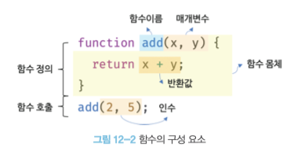

# 매개변수와 인수 (Parameters and Arguments)
<br>
<div class="message">
매개변수(parameter)는 함수의 정의 안에 있는 변수를 말한다</div> 

<div class="message">
인수(argument)는 함수를 호출할 때 패스되는 값이다</div>  

  

쉽게 외우자면 들어가는건 매개변수 나오는(?)건 인수... 인.. 인변... 인수..    

함수의 인수는 파이썬에서 꼭 필요로된다. 그래서 두 개의 매개변수를 정의하고 함수에 두 개의 인수를 패스하는게 표준함수의 정의이다. 
<br>

## 키워드 인수 (Keyword Arguments)

<div class="message">
키워드 인수는 말 그대로 인수에 이름(키워드)을 붙이는 기능인데 <strong>키워드</strong>=값 형식으로 사용한다. 
</div>

파이썬에서 함수를 호출할 때, 우리는 매개변수를 함수 정의할 때 썼던 순서 그대로 나열해야되는데 키워드 인수를 사용하면 그렇지 않아도 된다. 

함수가 선택적인 디폴트 인수를 많이 갖고 있을 때나 매개변수의 순서를 알기 어려울 때 키워드 인수를 사용하는 것이 유용한다.  
다음과 같은 함수가 선택적인 디폴트 인수를 많이 가지고 있는 함수이다.  

```python
# 디폴트 인수들을 많이 가진 함수를 정의해보자
def log_message(logging_style="shout", message="", font="Times", date=None):
  #로그_메세지() 함수를 정의했고 이 함수는 0에서 4개까지의 인수를 가질 수 있다
  if logging_style == 'shout':
    # 메세지를 대문자로 바꾸자
    message = message.upper()
  print(message, date)
 
# 키워드 인수 2개로 함수를 호출해보자
log_message(message="Hello from the past", date="November 20, 1693")
# 4개의 인수가 어떤 순서로 정의될 지 확실하지 않기 때문에 우리는 함수를 호출하기 위해서 매개변수 이름을 쓸 수 있다
```

우리가 함수를 호출하면서 신택스 <em>message</em>="Hello from the past" 를 사용한 점에 주의하자. 
여기서 이 키워드 message는 우리가 인수를 패스하고자하는 매개변수의 이름이어야한다.  
<br>

## 변형 가능한 객체를 디폴트 인수로 사용하지 않는다

디폴트 인수를 갖고 함수를 만들 때, 빈 리스트를 쓰고싶겠지만 그렇게하면 안 된다.  
파이썬에서 어떤 객체들은 변형가능하지 않아서 기본 인수로 사용하기 좋다.      

int, float를 비롯한 숫자들은 변형될 수 없다. 산술 연산은 새 숫자를 반환하는 것이다.  
튜플도 변형 불가능한 리스트에 속한다.  
문자열도 변형 불가하다 - 문자열을 업데이트하는 작업들도 새 문자열을 반환하고 있는 것이다.   

* 빈 리스트 대신 None 을 보초로 사용하자

```python
def update_order(new_item, current_order=None): 
  #current_order=[]대신 =None을 넣고
  if current_order is None: #None이라면
    current_order=[] #빈 리스트를 만들어주는 방법을 사용하자
  current_order.append(new_item)
  return current_order
```
<br>

## None

None은 파이썬에서 특별한 값이다. 유일무이하고 (두 개의 다른 None이란 없다!) 변형불가하다 (None을 업데이트하거나 새 속성을 부여할 수 없다)  
None 은 거짓으로 취급되서 if문에 넣으면 거짓을 반환한다. None은 유일무이하기 때문에 어떤 것이 None인지 테스트하고 싶을 때는 is 키워드를 사용한다. 

```python
# session_id을 none으로 정의한다
session_id = None
 
if session_id is None:
  print("session ID is None!")
  # 이걸 실행하면 "session ID is None!" 가 출력된다
 
# session_id에다가 뭔가를 할당할 수 있다
if active_session:
  session_id = active_session.id
 
# 하지만 active_session이 없다면, 우리는 개인정보를 보내지 않는다
if session_id is not None:
  send_sensitive_data(session_id)
```

함수가 아무것도 반환하지 않을때는 무엇을 반환할까? 수수께끼같은 질문이지만 정답은 있다.   
반환을 하지 않는 함수는 완료 후 None을 반환한다.  

```python
prints_return = print("이 함수는 무엇을 반환할까요?")

print(prints_return)
#결과 : None

# sort_this_list.sort()를 호출하고 list_sort_return에 저장한다
sort_this_list = [14, 631, 4, 51358, 50000000]
list_sort_return = sort_this_list.sort()

print(list_sort_return)
#결과 : None
```

## 주요 포인트 및 생각해볼 점
  해석할 때 용어집을 만들어야할까?
