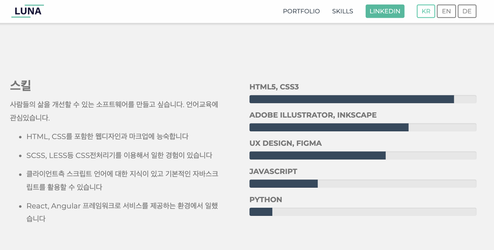
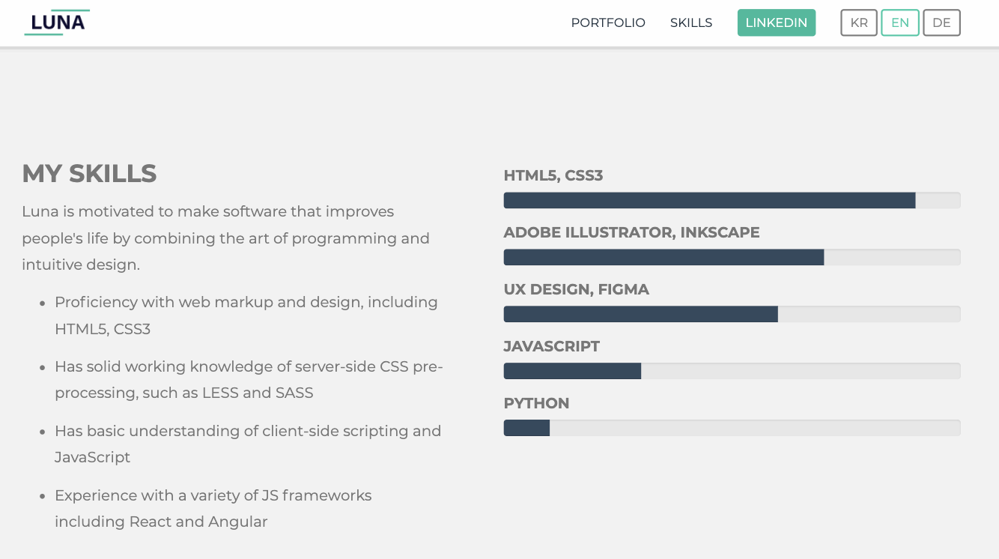

포트폴리오페이지에 간단한 자바스크립트 기능을 추가하기로 했다.  
시계는 한국과 독일의 시간을 넣고 시간에 따라 사진이 낮/밤으로 바뀌도록 했고 언어는 한국어,영어,독일어 세 가지가 바뀔 수 있도록 했다.  
[포트폴리오](https://lunaplease.com)

## 시계


* html 

```html
<!-- 한국 시계-->
<div class="layer-intro" id="pic-kr">
    <h2 class="clock-kr"></h2>
</div>
<!-- 독일 시계-->
<div class="layer-intro" id="pic-de">
    <h2 class="clock-de"></h2>
</div>
```
상관없는 부분은 생략했다.  

* css

```css
/* 도시 사진을 클래스마다 넣는다 */
.seoul-day {
  background-image: url(../images/seoul_day.jpeg);
  background-size: cover;
}
.seoul-night {
  background-image: url(../images/seoul_night.jpeg);
  background-size: cover;
  background-color: rgba(34, 49, 63, 0.6);
}
.berlin-day {
  background-image: url(../images/berlin_day.jpeg);
  background-size: cover;
  color: #333;
  background-color: rgba(34, 49, 63, 0.6);
}
.berlin-night {
  background-image: url(../images/berlin_night.jpeg);
  background-size: cover;
}
```
* javascript

```javascript
// clock-kr 클래스를 clock-kr 변수에 저장
var clock_kr = document.querySelector(".clock-kr");
var clock_de = document.querySelector(".clock-de");

function getTime() {
  // 자바스크립트에서 현재 시간 받아서 상수 curr에 저장 
  const curr = new Date();
  // 표준시간 UTC 구하기
  const utc = curr.getTime() + curr.getTimezoneOffset() * 60 * 1000;

  // UTC to KST 한국 (UTC + 9시간)
  const KR_TIME_DIFF = 9 * 60 * 60 * 1000;
  const kr_curr = new Date(utc + KR_TIME_DIFF);

  // UTC to CET 독일 (UTC + 1시간)
  const DE_TIME_DIFF = 1 * 60 * 60 * 1000;
  const de_curr = new Date(utc + DE_TIME_DIFF);

  // 시, 분 변수 저장
  let kr_hr = kr_curr.getHours();
  let kr_mm = kr_curr.getMinutes();
  let de_hr = de_curr.getHours();
  let de_mm = de_curr.getMinutes();

  //am, pm 표시
  var kr_ampm = kr_hr >= 12 ? "pm" : "am";
  var de_ampm = de_hr >= 12 ? "pm" : "am";

  // 10이하 숫자일때 보기 좋게 숫자 앞에 0 추가
  clock_kr.innerHTML =
    `${kr_hr < 10 ? `0${kr_hr}` : kr_hr}:${kr_mm < 10 ? `0${kr_mm}` : kr_mm}` +
    " " +
    kr_ampm;
  clock_de.innerHTML =
    `${de_hr < 10 ? `0${de_hr}` : de_hr}:${de_mm < 10 ? `0${de_mm}` : de_mm}` +
    " " +
    de_ampm;

  // 시간별로 사진 바꾸기
  // pic-kr 아이디를 obj_kr 변수에 저장
  var obj_kr = document.getElementById("pic-kr");
  var obj_de = document.getElementById("pic-de");
  // 7시 초과 18시 미만일 때 obj_kr 변수의 클래스를 seoul-day로 바꿈
  if (kr_hr > 7 && kr_hr < 18) {
    obj_kr.setAttribute("class", "seoul-day");
  } else {
    obj_kr.setAttribute("class", "seoul-night");
  }
  if (de_hr > 7 && de_hr < 18) {
    obj_de.setAttribute("class", "berlin-day");
  } else {
    obj_de.setAttribute("class", "berlin-night");
  }
}
// 1초마다 함수를 업데이트
setInterval(getTime, 1000);
```

## 언어 변경





* html

```html
<li>
  <a>
    <!-- 이 부분이 왜인지 꼭 필요하던데 숨길 수가 없어서 css로 숨겼다 -->
    <p id="language">
      <span data-lang="now_sys_lang"></span>
      <span id="locale"></span>
    </p>
    <!-- 각 언어별 버튼 -->
    <span id="btn-ko" class="nav-lang">KR</span>
    <span id="btn-en" class="nav-lang">EN</span>
    <span id="btn-de" class="nav-lang">DE</span>
  </a>
</li>
```
* css

```css
/* 비활성화 일때 버튼 클래스 */
.nav-lang {
  border: grey 2px solid;
  border-radius: 4px;
  padding: 5px 10px;
  color: grey
}
/* 활성화 일때 버튼 클래스 */
.active {
  border: #1ecba7 2px solid;
  color:#1ecba7
}
/* 마우스 올렸을 때 버튼 색 변화 */
#btn-en:hover{
  border: #1ecba7 2px solid;
  color:#1ecba7
}
#btn-ko:hover{
  border: #1ecba7 2px solid;
  color:#1ecba7
}
#btn-de:hover{
  border: #1ecba7 2px solid;
  color:#1ecba7
}
#language{
  display:none;
} 
```
* javascript

다국어지원 자바스크립트는 아래 블로그 글에서 복사해왔다.  
http://yoonbumtae.com/?p=2469

```javascript
// 언어별 JSON 파일
const lang = {
  en: {
    seoul: "Seoul",
    berlin: "Berlin",
    intro: "Introduction",
    intro_txt:
      "Luna is a foodie, film lover studying to become a useful developer. 2021 new year's resolution is to run regularly and polish on rusty piano skill. she majored in food science and worked as UX designer at K7music for a year and half.",
    title: "My Skills",
    content:
      "Luna is motivated to make software that improves people's life by combining the art of programming and intuitive design.",
    now_sys_lang: "EN",
    skill_a: "Proficiency with web markup and design, including HTML5, CSS3",
    skill_b:
      "Has solid working knowledge of server-side CSS pre-processing, such as LESS and SASS",
    skill_c: "Has basic understanding of client-side scripting and JavaScript",
    skill_d:
      "Experience with a variety of JS frameworks including React and Angular",
    contactme: "Feel free to contact me for your next project",
    portfolio: "Portfolio",
  },
  ko: {
    seoul: "서울",
    berlin: "베를린",
    intro: "자기소개",
    intro_txt:
      "맛있는 것과 재미있는 영화를 가장 좋아하는 30대 학생입니다. 올해에는 규칙적인 조깅과 피아노 실력향상을 목표로 하고있습니다. 식품영양을 전공했고 국비지원 자바 프론트엔드 과정을 들은 뒤에 독일의 인디음악회사에서 UX디자이너로 1년반정도 일했습니다. 앞으로 4개월간 잘 부탁드립니다!",
    title: "스킬",
    content:
      "사람들의 삶을 개선할 수 있는 소프트웨어를 만들고 싶습니다. 언어교육에 관심있습니다.",
    now_sys_lang: "KO",
    skill_a: "HTML, CSS를 포함한 웹디자인과 마크업에 능숙합니다",
    skill_b: "SCSS, LESS등 CSS전처리기를 이용해서 일한 경험이 있습니다",
    skill_c:
      "클라이언트측 스크립트 언어에 대한 지식이 있고 기본적인 자바스크립트를 활용할 수 있습니다",
    skill_d:
      "React, Angular 프레임워크로 서비스를 제공하는 환경에서 일했습니다",
    contactme: "궁금한 점이 있으면 언제든지 연락주세요",
    portfolio: "포트폴리오",
  },
  de: {
    seoul: "Seoul",
    berlin: "Berlin",
    intro: "Einführung",
    intro_txt:
      "Luna ist eine Feinschmeckerin und Filmliebhaberin, die studiert, um eine nützliche Entwicklerin zu werden. Der Vorsatz für das neue Jahr 2021 ist es, regelmäßig zu laufen und an rostigen Klavierkünsten zu polieren. sie studierte Lebensmittelwissenschaften und arbeitete eineinhalb Jahre als UX-Designerin bei K7music.",
    title: "Fahigkeit",
    content:
      "Luna ist motiviert, Software zu entwickeln, die das Leben der Menschen verbessert.",
    now_sys_lang: "DE",
    skill_a: "Kenntnisse in Web-Markup und -Design, einschließlich HTML5, CSS3",
    skill_b:
      "Hat solide Kenntnisse der serverseitigen CSS-Vorverarbeitung wie LESS und SASS",
    skill_c:
      "Hat grundlegende Kenntnisse in clientseitigem Scripting und JavaScript",
    skill_d:
      "Erfahrung mit einer Vielzahl von JS-Frameworks einschließlich React und Angular",
    contactme: "Kontaktieren Sie mich gerne für Ihr nächstes Projekt",
    portfolio: "Portfolio",
  },
};

// 아래부분 4가지는 복사해다 붙여넣기 했는데 무슨 뜻인지 아직 잘 모르겠다.
// 현재 브라우저의 언어 가져오기
function getLanguage() {
  return navigator.language || navigator.userLanguage;
}

// 언어별 적용
function init(localeStr) {
  document.getElementById("locale").textContent = localeStr;
}

// 초기 작업
const currentLang = getLanguage();
init(currentLang);
render(currentLang.substr(0, 2));

// 언어별 렌더링
function render(locale) {
  const $lang = document.querySelectorAll("[data-lang]");
  $lang.forEach((el) => {
    const code = el.dataset.lang;
    el.textContent = lang[locale][code];
  });
}

// 버튼 이벤트
document.getElementById("btn-en").addEventListener("click", (e) => {
  render("en");
});
document.getElementById("btn-ko").addEventListener("click", (e) => {
  render("ko");
});
document.getElementById("btn-de").addEventListener("click", (e) => {
  render("de");
});

// 버튼 활성화 - 비활성화일 때 클릭하면 활성화
$(".nav-lang").on("click", function () {
// nav-lang 클래스가 클릭되면 함수실행
  $(".nav-lang").removeClass("active");
  // nav-lang 클래스 모두(버튼3개)에서 active 클래스 삭제 
  $(this).addClass("active");
  // 클릭된 버튼 클래스에 active클래스 추가
});
```
