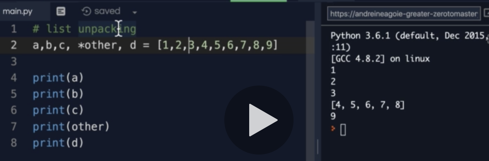

[백준 4673번 셀프넘버 문제](https://www.acmicpc.net/problem/4673) 

## 사고 과정

자기자신과 자기자신을 구성하는 숫자들을 더한 리스트를 만들고 정수리스트에서 뺀다.

```python
for i in range(1,10001):
    a = i + str(i)
    nums = []
    nums.append(a)
print(range(1,10001) - set(nums))
#런타임에러
```
<br>

## 제출 답안

```python
natural_num = set(range(1,10001)) 
generated_num = set() 

for i in range(1,10001):
    for j in str(i):
        i += int(j) 
    generated_num.add(i) # add 함수 사용

self_num = sorted(natural_num - generated_num)
for i in self_num:
    print(i)
```
[출처 in my duty 블로그](https://wook-2124.tistory.com/252) 
## 숏코딩

```python
r=range(9999);
print(*sorted({*r}-{n+sum(map(int,str(n)))for n in r}))
```
읽을 수가 없다 ㅋㅋㅋㅋ

## 주요 포인트 및 생각해볼 점 
add와 append의 차이점 알아보기  
set은 문자열 리스트에서만 쓸 수 있는걸까?

문제가 점점 어려워지고 있다. 
런타임에러가 안 나도록 문법은 맞춰서 제출해야겠다.  

*r 은 무엇을 의미하는걸까? 

06.18 추가    