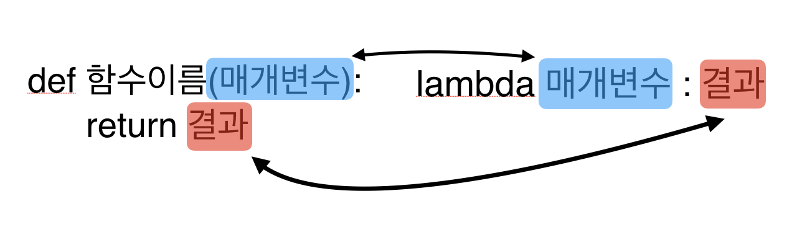

[실패율](https://programmers.co.kr/learn/courses/30/lessons/42889) 

## 문제 설명

슈퍼 게임 개발자 오렐리는 큰 고민에 빠졌다. 그녀가 만든 프랜즈 오천성이 대성공을 거뒀지만, 요즘 신규 사용자의 수가 급감한 것이다. 원인은 신규 사용자와 기존 사용자 사이에 스테이지 차이가 너무 큰 것이 문제였다.

이 문제를 어떻게 할까 고민 한 그녀는 동적으로 게임 시간을 늘려서 난이도를 조절하기로 했다. 역시 슈퍼 개발자라 대부분의 로직은 쉽게 구현했지만, 실패율을 구하는 부분에서 위기에 빠지고 말았다. 오렐리를 위해 실패율을 구하는 코드를 완성하라.

실패율은 다음과 같이 정의한다.
스테이지에 도달했으나 아직 클리어하지 못한 플레이어의 수 / 스테이지에 도달한 플레이어 수
전체 스테이지의 개수 N, 게임을 이용하는 사용자가 현재 멈춰있는 스테이지의 번호가 담긴 배열 stages가 매개변수로 주어질 때, 실패율이 높은 스테이지부터 내림차순으로 스테이지의 번호가 담겨있는 배열을 return 하도록 solution 함수를 완성하라.

## 입출력 예

<table>
  <thead>
    <tr>
      <th>n</th>
      <th>stages</th>
      <th>result</th>
    </tr>
  </thead>
  <tbody>
    <tr>
      <td>5</td>
      <td>[2, 1, 2, 6, 2, 4, 3, 3]</td>
      <td>[3,4,2,1,5]</td>
    </tr>
    <tr>
      <td>4</td>
      <td>[4,4,4,4,4]</td>
      <td>[4,1,2,3]</td>
    </tr>
  </tbody>
</table>

## 사고 과정

```python
def solution(n, stages):
    
    list_n = range(1,n+1)
    fail_rates = []
    failed_user = 0 # 실패한 사람의 수
    total_user = len(stages) 
    #전체 사용자의 수 : 실패한 사람들을 빼서 스테이지에 도달한 사람의 수로 사용    
    
    for n in list_n:
        if total_user == 0:
            #전체 사용자가 0이면 실패율0
            fail_rates.append(0)
        else:
            failed_user = stages.count(n)
            # 실패한 사람의 수 : 스테이지 배열에서 n의 갯수
            fail_rates.append(failed_user/total_user * 100)
            # 실패율 : 실패한 사람들의 수 / 스테이지에 도달한 사람의 수 * 100
            total_user -= failed_user
            # 전체 사용자의 수에서 실패한 사람들의 수를 뺀다
    print(fail_rates)
    # (1, 12.5)로 출력되는걸 보니 튜플로 만들어진건가??!!
    
    pair = list(zip(list_n, fail_rates))
    # 1부터N까지의 리스트와 fail_rates리스트를 대응해서 딕셔너리로 만들고 리스트에 넣는다.
    # 여기까지 출력하면 : [(1, 12.5), (2, 42.857142857142854), (3, 50.0), (4, 50.0), (5, 0.0)]  
    pair_sorted = sorted(pair, key= lambda x : dict[x], reverse=True)
    # 밸류인 실패율을 기준으로 내림차순 정렬하고 키값을 반환한다. 여기서 에러발생
    print(pair_sorted)
    return pair_sorted 
```

이 딕셔너리를 밸류 값 기준으로 내림차순 정렬하고 키값을 반환하려면  
아래와 같이 람다라는걸 사용해야 되는 것 같다.

```python
sorted(딕셔너리이름, key= lambda x : dict[x])
```
* 여기서 잠깐, 람다함수(익명함수)란?

함수를 간단하게 한 줄로 쓰게해주는 문법이다.  
[출처 : 위키독스 - 람다함수란?](https://wikidocs.net/22804)

실행했더니 타입에러가 난다.  
TypeError: '<' not supported between instances of 'types.GenericAlias' and 'types.GenericAlias'  
자료형에 대한 에러가 나는 것 같으니 모범답안처럼 자료형을 바꿔보았다.

## 제출 답안
```python
def solution(n, stages):
    
    list_n = range(1,n+1)
    fail_rates = {}
    # []는 빈 배열을 만들고 {}는 빈 딕셔너리를 만든다.
    failed_user = 0 
    total_user = len(stages)     
    
    for n in list_n:
        if total_user == 0:
            fail_rates[n] = 0
        else:
            failed_user = stages.count(n)
            fail_rates[n] = failed_user/total_user
            total_user -= failed_user
    return sorted(fail_rates,key=lambda x : fail_rates[x], reverse=True)
```
드디어 성공..!!! 반나절이 걸렸다..!!  
3일 쉬고 다시 써보라고하면 못 쓸것 같다. 매일 공부하고 반복 학습을 해야지!

## 모범 답안

```python
def solution(N, stages):
    fail_rate = {}
    total_user = len(stages)

    for stage in range(1, N+1):
        if total_user != 0:
            fail_user = stages.count(stage)
            fail_rate[stage] = fail_user / total_user
            #여기서는 zip이 아닌 arr1[arr2]를 사용했다
            total_user -= fail_user
        else:
            fail_rate[stage] = 0

    return sorted(fail_rate, key=lambda x : fail_rate[x], reverse=True)
```

## 모범 답안2
```python
def solution(N, stages):
    result = {}
    denominator = len(stages)
    for stage in range(1, N+1):
        if denominator != 0:
            count = stages.count(stage)
            result[stage] = count / denominator
            denominator -= count
        else:
            result[stage] = 0
    return sorted(result, key=lambda x : result[x], reverse=True)
```
이 부분은 내일 다시 살펴봐야겠다.

## 질문

  fail_rates = [] 이렇게 딕셔너리로 만들었었는데   
  print(fail_rates)  
  이 부분이 (1, 12.5)로 출력되는걸 보니 튜플로 만들어져서 에러가 난걸까?   
<br>

## 주요 포인트 및 생각해볼 점   

  -arr1\[arr2]로 딕셔너리를 만드는 방법  
  -파이썬 딕셔너리 정렬하기  
<br>

## 파이썬에서 (), {}, []의 차이점
```python
  arr = [] # 빈 배열을 만들 때 []사용  
  arr = [1,2,3,4] #원소가 있는 배열을 만들 때 []사용  
  arr[3] #배열의 3번째 원소에 접근할 때 []사용  

  mytuple = () #빈 튜플 생성할 때 ()사용  
  mytuple = (1,2,3,4) # 원소가 있는 튜플을 만들 때 ()사용  
  mytuple[3] # 튜플의 원소에 접근할 때 []사용  

  mydictionary = {} #빈 딕셔너리 생성 시 {}사용  
  mydictionary = {"mouse":3, "penguin":5}  
  mydictionary["mouse"] # key("mouse")에 대응하는 value(3)에 접근할 때 사용  
  mydictionary["cat"] = 1 # key("cat")에 대한 value(1) 생성  
```
  [출처: 해시코드 - () [] {}의 차이와 사용해야 할 곳](https://hashcode.co.kr/questions/4118/%EC%9D%98-%EC%B0%A8%EC%9D%B4%EC%99%80-%EC%82%AC%EC%9A%A9%ED%95%B4%EC%95%BC-%ED%95%A0-%EA%B3%B3)
