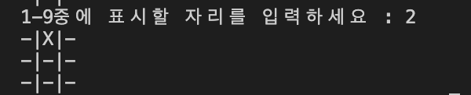
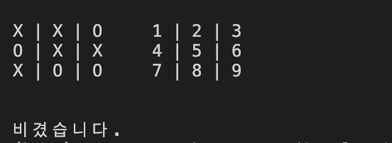

틱택토 게임을 만들어보자!   
9칸을 그리고 두 명이서 O,X를 차례대로 그려서 먼저 빙고하는 사람이 이기는 게임이다. 유투브 [Python for absolute beginners 2019 - TIC TAC TOE project](https://www.youtube.com/watch?v=BHh654_7Cmw) 를 보고 따라 만들었다.  

먼저 구조를 짜보자  

## 구조
```python
#보드
#보드판
#게임 시작
#턴 처리하기
#게임이 계속 진행중인지 끝났는지 확인
    #이겼는지 확인
        #가로 확인
        #세로 확인
        #대각선 확인
    #비겼는지 확인
#플레이어 바꾸기
```

각 구조별로 기본 코드를 넣어보자  

## 보드
```python
board = ["-","-","-",
         "-","-","-",
         "-","-","-"]
```
## 보드판
```python
def display_board():
  print("\n")
  print(board[0] + " | " + board[1] + " | " + board[2] + "     1 | 2 | 3")
  print(board[3] + " | " + board[4] + " | " + board[5] + "     4 | 5 | 6")
  print(board[6] + " | " + board[7] + " | " + board[8] + "     7 | 8 | 9")
  print("\n")
```
## 게임 플레이
```python
def play_game():
    #첫 보드 보여주기 
    display_board()
```
## 턴 처리하기
```python
def handle_turn():
    position = input("1-9중에 표시할 자리를 입력하세요 : ")
    #수를 입력받는다
    position = int(position) - 1
    #index가 0부터 시작하므로 1빼주기
    
    board[position] = "X"
    #입력받은 수 빼기1 인덱스의 -를 X로 바꾼다
    display_board()
```

여기까지 멈추고 코드를 복사 붙여넣기해서 한 번 돌려보면 내가 입력한 숫자에 해당하는 판에 X자가 표시되는 화면을 볼 수 있다.



## 게임 플레이
```python
def play_game():
    #첫 보드 보여주기 
    display_board()
        
    #"게임이 아직 진행중" 변수가 사실일 동안에    
    while game_still_going:
        #현재 플레이어의 턴을 실행하고
        handle_turn(current_player)
        #게임이 끝났는지 확인하고
        check_if_game_over()
        #플레이어를 바꾼다
        flip_player()
```

## 게임이 계속 진행중인지 확인
```python
def check_if_game_over():
    #게임이 끝났는지 볼 수 있는 방법은 무엇이 있을까?
    check_for_winner()
    #누가 이겼거나
    check_if_tie()
    #이긴 사람 없이 판이 꽉 찼거나
```
## 이겼는지 비겼는지 확인
```python
def check_for_winner():
    #가로 확인
    #세로 확인
    #대각선 확인
    return
def check_if_tie():
    return
```

## 플레이어 바꾸기
```python
def flip_player():
    return
```
이정도 쓰고 에러가 없는지 돌려보면,    
game_still_going 변수가 정의되지 않았다고 나온다.  
이 변수는 여기저기서 사용될 수 있으니까 전역 변수(global bariables)로 정의한다.  
맨 위에 필요한 전역 변수들을 넣어주자.

## 보드
```python
#------- 전역 변수 -------

# 게임 보드
board = ["-","-","-",
         "-","-","-",
         "-","-","-"]
# 게임이 계속 진행중이라면
game_still_going = True

# 누가 이겼나? 비겼나?
winner = None

# 누구 차례인가?
current_player = "X"

```

게임플레이로 가서 게임이 끝났을 때 승자를 출력하는 코드를 넣어보자.

## 게임 플레이
```python
def play_game(): 
    display_board()
        
    while game_still_going:

        handle_turn(current_player)

        check_if_game_over()

        flip_player()

    #게임이 끝났으면
    if winner == "X" or winner == "O":
        print("우승자는"+ winner+"!")
    elif winner == None:
        print("비겼습니다.")
```

이겼는지 비겼는지 확인하는 부분에  
가로 확인, 세로 확인, 대각선 확인 함수를 넣고  
누군가 이기면 승자를 출력하고 game_still_going 변수를 거짓으로 바꾸자.

## 이겼는지 확인
```python
def check_for_winner():
    #전역변수를 함수 안에서 가져다 사용하려면 선언해줘야한다 
    global winner

    #가로 확인
    row_winner = check_rows()
    #세로 확인
    column_winner = check_columns()
    #대각선 확인
    diagonal_winner = check_diagonals()
    if row_winner:
        winner = row_winner
    elif column_winner:
        winner = column_winner
    elif diagonal_winner:
        winner = diagonal_winner
    else:
        winner = None
    return

def check_rows():
    #전역변수 선언
    global game_still_going
    #첫째줄의 값 "-" 가 아니고 모두 같다면 row_1이 true가 된다
    row_1 = board[0] == board[1] == board[2] != "-"
    row_2 = board[3] == board[4] == board[5] != "-"
    row_3 = board[6] == board[7] == board[8] != "-"
    # 세 줄 중에 하나라도 트루면 게임 끝
    if row_1 or row_2 or row_3:
        game_still_going = False
    # 우승자 반환 
    if row_1:
        return board[0]
    elif row_2:
        return board[3]
    elif row_3:
        return board[6]

def check_columns():
    global game_still_going
    column_1 = board[0] == board[3] == board[6] != "-"
    column_2 = board[1] == board[4] == board[7] != "-"
    column_3 = board[2] == board[5] == board[8] != "-"
    if column_1 or column_2 or column_3:
        game_still_going = False
    if column_1:
        return board[0]
    elif column_2:
        return board[1]
    elif column_3:
        return board[2]

def check_diagonals():
    global game_still_going
    diagonals_1 = board[0] == board[4] == board[8] != "-"
    diagonals_2 = board[6] == board[4] == board[2] != "-"
    if diagonals_1 or diagonals_2:
        game_still_going = False
    if diagonals_1:
        return board[0]
    elif diagonals_2:
        return board[6]
```

플레이어를 바꾸는 함수를 넣어보자

## 플레이어 바꾸기
```python
def flip_player():
    global current_player
    if current_player == "X":
        current_player = "O"
    elif current_player == "O":
        current_player = "X"
```

## 비겼는지 확인
```python
def check_if_tie():
    global game_still_going
    #보드판에 더이상 -가 남아있지 않으면 게임 끝
    if "-" not in board:
        game_still_going = False
```

입력 예외처리정도를 제외하고 이제 거의 다 만들었다!  입력 예외처리를 추가하자

## 턴 처리하기
```python
def handle_turn(player):
    #if 대신 while을 써줘야 유효값이 들어올 때까지 계속해서 물어보게된다
    while position not in ["1","2","3","4","5","6","7","8","9"]:
        position = input("유효하지 않은 입력값입니다. 1과 9중의 수를 입력해주세요")
```

여기서 프로그램을 돌려보면, 이미 X친 자리에 다시 O를 넣어도 O가 들어가는걸 볼 수 있다. 이걸 방지하기 위한 코드를 넣어보자.

```python
def handle_turn(player):
    if board[position] != "-":
        print("이미 표시된 자리입니다")
```

이걸 합쳐서 잘 써보면

```python
턴 처리하기
def handle_turn(player):

    print(player + "의 턴입니다")
    position = input("1-9중에 표시할 자리를 입력하세요 : ")

    valid = False
    while not valid:

        while position not in ["1","2","3","4","5","6","7","8","9"]:
            position = input("유효하지 않은 입력값입니다. 1과 9중의 수를 입력해주세요")
    
        position = int(position) - 1    
    
        if board[position] == "-":
            valid = True
        else:
            print("이미 표시된 자리입니다")

    board[position] = player

    display_board()
```



게임 만들기가 완료되었다~!!!

## 최종 전체 코드
```python

#------- 전역 변수 -------

# 게임 보드
board = ["-","-","-",
         "-","-","-",
         "-","-","-"]
# 게임이 계속 진행중이라면
game_still_going = True

# 누가 이겼나? 비겼나?
winner = None

# 누구 차례인가?
current_player = "X"

def display_board():
    print("\n")
    print(board[0] + " | " + board[1] + " | " + board[2] + "     1 | 2 | 3")
    print(board[3] + " | " + board[4] + " | " + board[5] + "     4 | 5 | 6")
    print(board[6] + " | " + board[7] + " | " + board[8] + "     7 | 8 | 9")
    print("\n")

#보드판
def play_game():
    #첫 보드 보여주기 
    display_board()
    handle_turn(current_player)

#턴 처리하기
def handle_turn(player):

    print(player + "의 턴입니다")
    position = input("1-9중에 표시할 자리를 입력하세요 : ")

    valid = False
    while not valid:

        while position not in ["1","2","3","4","5","6","7","8","9"]:
            position = input("유효하지 않은 입력값입니다. 1과 9중의 수를 입력해주세요")
    
        position = int(position) - 1    
    
        if board[position] == "-":
            valid = True
        else:
            print("이미 표시된 자리입니다")

    board[position] = player

    display_board()

#게임 플레이
def play_game():
    #첫 보드 보여주기 
    display_board()

    #"게임이 아직 진행중" 변수가 사실일 동안에    
    while game_still_going:
        
        #현재 플레이어의 턴을 실행하고
        handle_turn(current_player)
        
        #게임이 끝났는지 확인하고
        check_if_game_over()
        
        #플레이어를 바꾼다
        flip_player()
        
    #게임이 끝났으면
    if winner == "X" or winner == "O":
        print("우승자는"+ winner+"!")
    elif winner == None:
        print("비겼습니다.")

# 게임이 계속 진행중인지 확인
def check_if_game_over():
    #게임이 끝났는지 볼 수 있는 방법은 무엇이 있을까?
    check_for_winner()
    #누가 이겼거나
    check_if_tie()
    #이긴 사람 없이 판이 꽉 찼거나

def check_for_winner():
    #전역변수를 함수 안에서 가져다 사용하려면 선언해줘야한다 
    global winner

    #가로 확인
    row_winner = check_rows()
    #세로 확인
    column_winner = check_columns()
    #대각선 확인
    diagonal_winner = check_diagonals()
    if row_winner:
        winner = row_winner
    elif column_winner:
        winner = column_winner
    elif diagonal_winner:
        winner = diagonal_winner
    else:
        winner = None

def check_rows():
    #전역변수 선언
    global game_still_going
    #첫째줄의 값 "-" 가 아니고 모두 같다면 row_1이 true가 된다
    row_1 = board[0] == board[1] == board[2] != "-"
    row_2 = board[3] == board[4] == board[5] != "-"
    row_3 = board[6] == board[7] == board[8] != "-"
    # 세 줄 중에 하나라도 트루면 게임 끝
    if row_1 or row_2 or row_3:
        game_still_going = False
    # 우승자 반환 
    if row_1:
        return board[0]
    elif row_2:
        return board[3]
    elif row_3:
        return board[6]

def check_columns():
    global game_still_going
    column_1 = board[0] == board[3] == board[6] != "-"
    column_2 = board[1] == board[4] == board[7] != "-"
    column_3 = board[2] == board[5] == board[8] != "-"
    if column_1 or column_2 or column_3:
        game_still_going = False
    if column_1:
        return board[0]
    elif column_2:
        return board[1]
    elif column_3:
        return board[2]

def check_diagonals():
    global game_still_going
    diagonals_1 = board[0] == board[4] == board[8] != "-"
    diagonals_2 = board[6] == board[4] == board[2] != "-"
    if diagonals_1 or diagonals_2:
        game_still_going = False
    if diagonals_1:
        return board[0]
    elif diagonals_2:
        return board[6]

def check_if_tie():
    global game_still_going
    #보드판에 더이상 -가 남아있지 않으면 게임 끝
    if "-" not in board:
        game_still_going = False

def flip_player():
    global current_player
    if current_player == "X":
        current_player = "O"
    elif current_player == "O":
        current_player = "X"

# ------------ 게임 시작 -------------

play_game()

```


