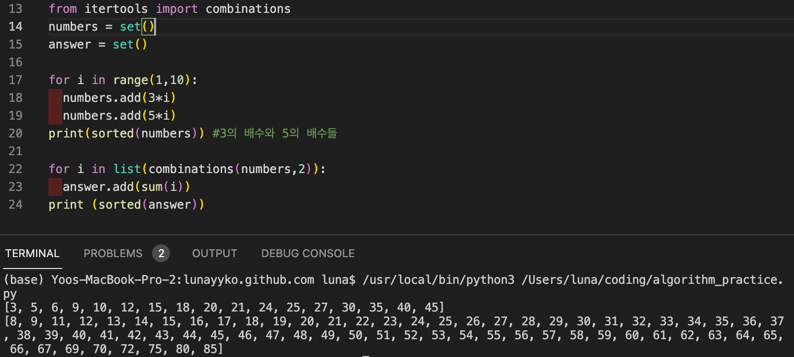

## 문제 설명

상근이는 요즘 설탕공장에서 설탕을 배달하고 있다. 상근이는 지금 사탕가게에 설탕을 정확하게 N킬로그램을 배달해야 한다. 설탕공장에서 만드는 설탕은 봉지에 담겨져 있다. 봉지는 3킬로그램 봉지와 5킬로그램 봉지가 있다.

상근이는 귀찮기 때문에, 최대한 적은 봉지를 들고 가려고 한다. 예를 들어, 18킬로그램 설탕을 배달해야 할 때, 3킬로그램 봉지 6개를 가져가도 되지만, 5킬로그램 3개와 3킬로그램 1개를 배달하면, 더 적은 개수의 봉지를 배달할 수 있다.

상근이가 설탕을 N킬로그램 배달해야 할 때, 봉지 몇 개를 가져가면 되는지 구하는 프로그램을 작성하시오. 상근이가 배달하는 봉지의 최소 개수를 출력한다. <strong>정확하게 N킬로그램을 만들 수 없다면 -1을 출력한다.</strong>

## 사고 과정

5로 나눈 몫 + 5로 나눈 나머지를 3으로 나눈 몫이 봉지수일 것이다.
5로 나눈 나머지를 3으로 나눈 나머지가 있는 경우 -1을 출력한다.
(무조건 5kg봉지에 먼저 넣을거라고 잘못 생각했다)

```python
n = int(input())
count = 0
if int(n%5%3 != 0):
    print(-1)
else: 
    print(n//5+ n%5//3)    
```
11에서 틀렸다. 11을 5x2봉지 +1이 아닌 5x1봉지 3x2봉지로 완벽하게 담을 수 있기 때문이다.

그렇다면 완벽하게 담을 수 있는 수를 모두 구하기 위해서  
3의 배수와 5의 배수 집합의 원소끼리 더해서 나올 수 있는 모든 값을 출력해볼까?

```python
from itertools import combinations
numbers = set()
answer = set()

for i in range(1,10):
  numbers.add(3*i)
  numbers.add(5*i)
print(sorted(numbers)) #3의 배수와 5의 배수들

for i in list(combinations(numbers,2)):
  answer.add(sum(i))
print (sorted(answer))
```



이 집합이 5000까지 나오도록 만든다음 이 리스트에 없으면 -1을 출력하는 코드를 만들어보자.

```python
from itertools import combinations
numbers = set()
answer = set()

for i in range(0,510):
  numbers.add(3*i)
  numbers.add(5*i)
print(sorted(numbers)) #3의 배수와 5의 배수들

for i in list(combinations(numbers,2)):
  answer.add(sum(i))
print (sorted(answer))

n = int(input())
count = 0

if n in answer:
    count = n//5+ n%5//3
    if int(n%5%3 != 0):
        count += 1
    print(count)

if n not in answer:
    print(-1)
```
길긴 하지만 11을 입력했을 때 3이 잘 나온다. 제출하니 출력 초과가 뜬다.  
예전에 제출한 자바코드를 한 번 살펴보자.

```java
import java.util.Scanner;

public class Main{
    public static void main(String[] args){
        Scanner sc = new Scanner(System.in);
        int n = sc.nextInt();
        sc.close(); //이러쿵저러쿵
        // 5로 나눈 몫을 카운트에 저장한다
        int count = n/5;
        // 5로 나눈 나머지가 
        switch (n % 5) {
            //0이라면 카운트를 출력하고
            case 0 :
                System.out.println(count);
                break;
            // 1이나 3이라면 카운트에 1을 더한다
            // 1이면 5대신 3사용, 3이면 3하나 추가
            case 1 :
            case 3 :
                System.out.println(count+1);
                break;
            // 2인데 카운트 값이 0이나 1이면 -1을 출력한다
            case 2 :
                if (count < 2) {
                    System.out.println(-1);
            // 아니면 카운트에 2를 더한다(5대신 3을2개 더 사용)
                } else {
                    System.out.println(count+2);
                }
                break;
            // 4인데 카운트가 0이라면 -1을 출력한다
            case 4 :
                if (count < 1) {
                    System.out.println(-1);
                //아니면 카운트에 2를 더한다(5대신 3을2개 더 사용)
                } else {
                    System.out.println(count+2);
                }
                break;
        }
    }
    
}
```

뇌가 퇴행했나?!  
수첩에 써보니까 12이상부터는 규칙이 반복되는 것 같다.    
1부터 20정도까지 수첩에 쓰면서 생각해보면 쉽다.  
파이썬으로 다시 작성해보자

## 제출 답안

```python
sugar = int(input())
remainder = sugar % 5

if remainder == 0:
    print(sugar//5)
if remainder == 1 or remainder ==3:
    print(sugar//5 +1)
if remainder == 2:
    if sugar//5 < 2:
        print(-1)
    else:
        print(sugar//5 +2)
if remainder == 4:
    if sugar//5 < 1:
        print(-1)       
    else:
        print(sugar//5 +2)
```
잘 작동하지만 뭔가 찜찜한 풀이이다.

## 다른 풀이

```python
n = int(input())
i = 0
if(n%5 == 0):
    print(n//5)
elif(n==1 or n==2 or n==4 or n==7):
    print(-1)
    #1,2,4,7이 남으면 나누어떨어지지 않는다
else:
    while(n>0):
        i = i+1 #i는 3kg봉지 갯수
        n = n-3 #총 설탕에서 3kg뺀다
        if(n%5 == 0): #5로 나눠질때까지 반복
            j = int(n/5)#j는 5kg봉지 갯수 
            print(j+i)
            break
```
반복문 안의 while문에서 3을 계속 빼는 발상이 좋다.  
그런데 while에서 3을 계속 빼도 5로 나눠지지 않으면 elif로 가는건가..? 잘 모르겠다.

다른 블로그에서 풀이를 찾아보았다.
<br>
1. 5로 나눌 수 있으면 나눈다.   
2. 5로 못나누면 입력값에서 3을 빼고 count를 올린다.   
3. 1,2번을 반복하는데 만약 5로 못나누고 계속 3을 빼면서 입력값이 0보다 작아진다면 -1를 리턴해준다.  

이 아이디어는 "5로 나눌 수 있으면 무조건 나눠라"가 핵심 아이디어이다.
아래 소스 코드를 확인해보자.  
[출처 : 폴로러브 블로그](https://pololove.tistory.com/40)

## 모범 답안

```python
n = int(input())
count =0

while True:
  if n%5==0:
    count = count + n//5
    print(box)
    break
  else :
    n = n-3
    count +=1
  if n<0:
    print(-1)
    break
```

## 주요 포인트 및 생각해볼 점   
코드를 쓰기전에 예외들을 포함한 풀이과정을 곰곰히 생각해봐야겠다.