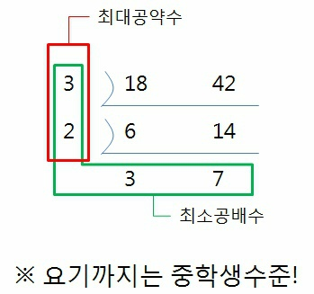

[프로그래머스 - 최대공약수와 최소공배수](https://www.acmicpc.net/problem/12940) 

## 문제 설명

두 수를 입력받아 두 수의 최대공약수와 최소공배수를 반환하는 함수, solution을 완성해 보세요. 배열의 맨 앞에 최대공약수, 그다음 최소공배수를 넣어 반환하면 됩니다. 예를 들어 두 수 3, 12의 최대공약수는 3, 최소공배수는 12이므로 solution(3, 12)는 [3, 12]를 반환해야 합니다.

## 사고 과정

약수 리스트, 배수 리스트를 구한다.  
리스트 두 개에서 공통으로 가지는 약수 중 가장 큰 수/ 작은 수를 출력한다.

```python
#약수 리스트를 구하는 함수
def divisor(n):
  divisors = []
  for i in range(1, n+1):
      if n%i ==0:
          divisors.append(i)
  return divisors 

#배수 리스트를 구하는 함수
def multiple(m):
    multiples = []
    for i in range(1, 101):
        if i%m ==0:
            multiples.append(i)
    return multiples

#두 수의 최대공약수를 구하는 함수
def max_divisor(n,m):
    max_divisors = []
    for i in divisor(n): 
        if i in divisor(m):
            max_divisors.append(i)
    return max(max_divisors)

#두 수의 최소공배수를 구하는 함수
def min_multiple(n,m):
      min_multiples = []
      for i in multiple(n): 
          if i in multiple(m):
              min_multiples.append(i)
      return min(min_multiples)

def solution(n,m):
    print(max_divisor(n,m), min_multiple(n,m))
    return(max_divisor(n,m), min_multiple(n,m))

n = int(input())
m = int(input())
solution(n,m)
```

배수 리스트 크기가 너무 크다.
파이썬에 fractions, gcd라는게 있는지 몰랐다.

## 제출답안

```python
from fractions import gcd
def gcdlcm(a,b):
    return[gcd(a,b), a*b/gcd(a,b)]
```

최대공약수 = greatest common divisor = gcd  
최소공배수 = least common multiple = lcm  

  

그림에서 알 수 있듯이,  
최소공배수 = 두 수의 곱 / 최대공약수 이다.  
lcm = a*b / gcd

## 모범 답안

```python
def gcdlcm(a, b):
    c, d = max(a, b), min(a, b) #둘 중 큰 값, 작은 값
    t = 1
    while t > 0: 
        t = c % d 
        c, d = d, t 
    answer = [c, int(a*b/c)] 

    return answer
```

최대공약수만 구해지면 주어진 두 수로 최대공약수를 구할 수 있으니까  
큰 수를 작은수로 나누어서 나온 나머지로 큰 수를 나눈다.  
나머지가 0이 될때까지 계속 반복하면 나머지가 0일 나눈 값이 최대공약수가 된다.  
예를 들어서   
35%25 = 10    
35%10 = 5  
35%5 = 0  
이면 최대공약수가 5가 된다.

## 주요 포인트 및 생각해볼 점  

수학적인걸 생각해보는건 좋지만 시간이 너무 오래 걸리는 것은 좋지 않다.