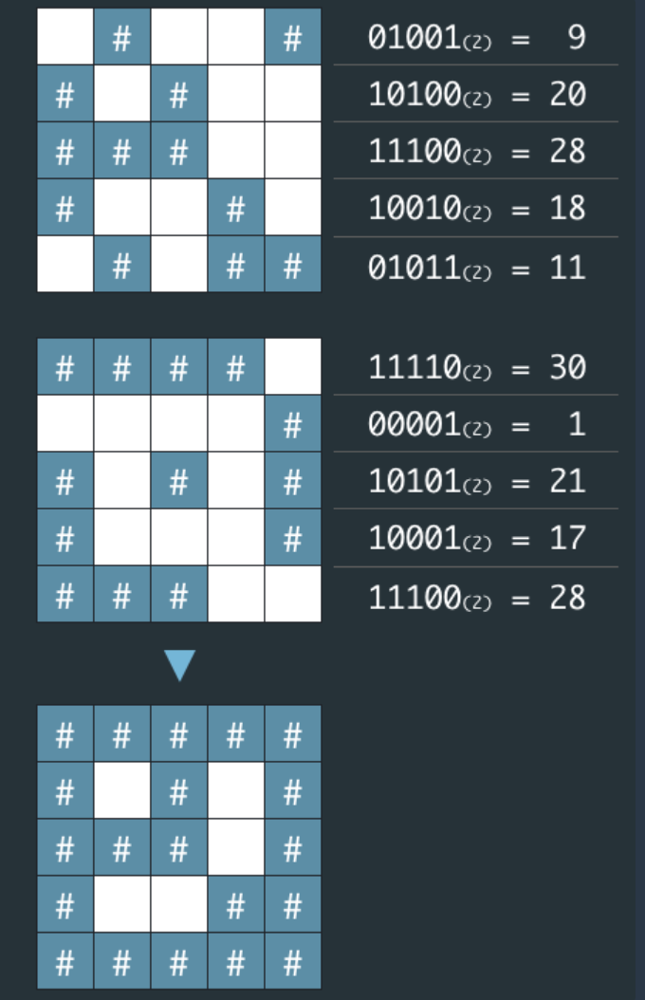

## 문제 설명

네오는 평소 프로도가 비상금을 숨겨놓는 장소를 알려줄 비밀지도를 손에 넣었다. 그런데 이 비밀지도는 숫자로 암호화되어 있어 위치를 확인하기 위해서는 암호를 해독해야 한다. 다행히 지도 암호를 해독할 방법을 적어놓은 메모도 함께 발견했다.

1.지도는 한 변의 길이가 n인 정사각형 배열 형태로, 각 칸은 "공백"(" ") 또는 "벽"("#") 두 종류로 이루어져 있다.  
2.전체 지도는 두 장의 지도를 겹쳐서 얻을 수 있다. 각각 "지도 1"과 "지도 2"라고 하자. 지도 1 또는 지도 2 중 어느 하나라도 벽인 부분은 전체 지도에서도 벽이다. 지도 1과 지도 2에서 모두 공백인 부분은 전체 지도에서도 공백이다.  
3."지도 1"과 "지도 2"는 각각 정수 배열로 암호화되어 있다.  
4.암호화된 배열은 지도의 각 가로줄에서 벽 부분을 1, 공백 부분을 0으로 부호화했을 때 얻어지는 이진수에 해당하는 값의 배열이다.  

원래의 비밀지도를 해독하여 '#', 공백으로 구성된 문자열 배열로 출력하라.




## 입출력 예

<table>
  <thead>
    <tr>
      <th>매개변수</th>
      <th>값</th>
    </tr>
  </thead>
  <tbody>
    <tr>
      <td>n</td>
      <td>5</td>
    </tr>
    <tr>
      <td>arr1</td>
      <td>[9, 20, 28, 18, 11]</td>
    </tr>
    <tr>
      <td>arr2</td>
      <td>[30, 1, 21, 17, 28]</td>
    </tr>
    <tr>
      <td>출력</td>
      <td>["#####","# # #", "### #", "# ##", "#####"]</td>
    </tr>
  </tbody>
</table>

## 사고과정

1.일단 수들을 이진수로 바꾸고   
2.바뀐 수들을 비교해서 둘 중에 하나라도 1이면  
3.1로 새 배열에 저장한다.

```python
def solution(n, arr1, arr2):
    arr3 = []
    arr4 = []
    for i in range(0, n):
        arr3.append(bin(arr1[i]))
        arr4.append(bin(arr2[i]))
    #여기까지 1번
```

2번을 어떻게할지 모르겠어서 다른 블로그를 참고했는데 두 수를 더하는 방법이 있길래  ([두수를 더하는 방법을 사용한 아이티가든 블로그](https://it-garden.tistory.com/234)) 어떻게 그렇게 하는것인지 의문이 들었다. 다른 답안에서는 zip과 or(\|)를 사용했다.

## 모범 답안

```python
def solution(n, arr1, arr2):
    answer = []

    for i,j in zip(arr1, arr2):
        ans = str(bin(i|j)[2:])#2진수 표시인 ob제거
        ans = ans.zfill(n)#자릿수를 맞춰주는 zfill이라는게 있었다!
        ans = ans.replace('1', '#')
        ans = ans.replace('0', ' ')
        answer.append(ans)
    return answer
```

## 주요 포인트 및 생각해볼 점

이렇게 발견한 함수들은 잊어버리지 않을 것 같다. 오랜시간 고민했는데 간단하게 함수를 사용해서 풀 수 있었어서, 너무 오래 고민하지 말아야겠다는 생각이 들었다.

마크업에서 \| 이걸 치면 | 표를 만들 수 있다는 사실을 | 발견했다.