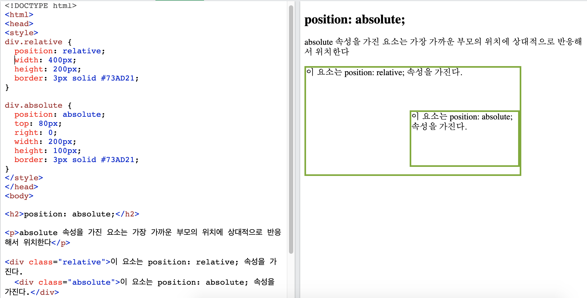
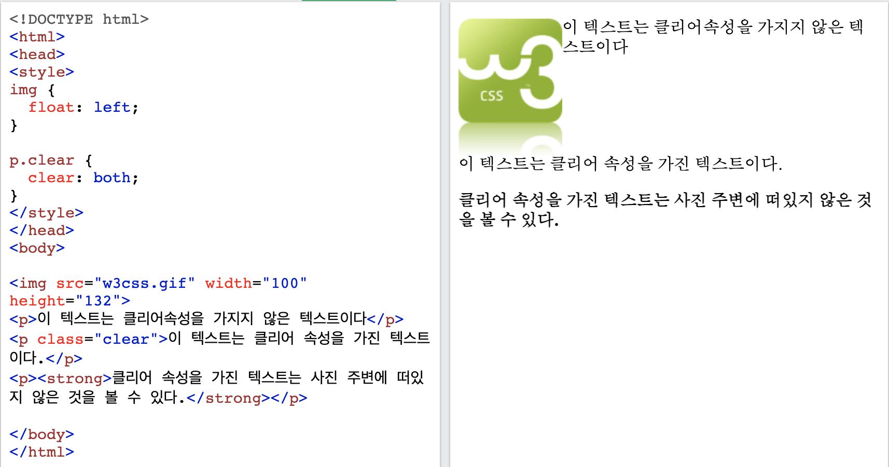

CSS를 처음 배웠을때 레이아웃을 잡는게 가장 어려웠던 기억이 난다.  
grid, flex등 여러가지 새로운 방법들이 등장했지만 역시 display:inline-block 과 부모에게 position: relative을 주고 자식에게 position:absolute를 주는 방법으로 레이아웃을 조절하는 것이 가장 많이 쓰이고 있는 것 같다.

## position - relative, absolute, fixed

처음 외울때는 부모가 어린 자식에게 유연하게 대응한다고 생각하면 좋을 것 같다.
기준이 되고자 하는 부모 요소에게 position: relative을 주고 자식에게 position:absolute를 줌으로서 자식 요소가 부모 요소를 기준으로 상대적으로 움직일 수 있게 한다. 

## inline, inline-block, block 에 대해서

display:inline은 요소를 마치 텍스트처럼 취급한다. 
display:block은 <strong>가로로 갈 수 있는 끝까지 공간을 차지한다.</strong>
display:inline-block은 요소를 블럭처럼 취급하지만 옆에 공간이 남으면 다음 요소를 끼워넣는 것을 허락한다.
## float

float 속성은 요소를 한 쪽으로 띄워서 정렬하는데 쓰인다.
주의 : 절대 위치를 준 요소는 float속성을 무시한다.

float속성을 가진 요소는 주변 요소들이 이를 따라 흘러가게 만든다. 이를 방지하려면 다음 요소에 clear 속성을 주어야한다.

