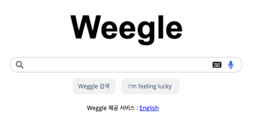

전에 일하면서 익혔던 grid로 만들어보았다.

## 구현 화면


<iframe height="300" style="width: 100%;" scrolling="no" title="wecode search bar" src="https://codepen.io/lunayyko/embed/MWmKzLG?defaultTab=html%2Cresult" frameborder="no" loading="lazy" allowtransparency="true" allowfullscreen="true">
  See the Pen <a href="https://codepen.io/lunayyko/pen/MWmKzLG">
  wecode search bar</a> by Luna YooYoung Ko (<a href="https://codepen.io/lunayyko">@lunayyko</a>)
  on <a href="https://codepen.io">CodePen</a>.
</iframe>

## HTML

```html
<!DOCTYPE html>
<html>
  <head>
    <meta charset="utf-8">
    <meta name="viewport" content="width=device-width, initial-scale=1.0">
    <title>repl.it</title>
    <link href="style.css" rel="stylesheet" type="text/css" />
    <link rel="stylesheet" href="https://cdnjs.cloudflare.com/ajax/libs/font-awesome/5.15.3/css/all.min.css"/>
    <link href="https://fonts.googleapis.com/css2?family=Open+Sans&display=swap" rel="stylesheet">
  </head>
  <body>
    <div class="wrapper">
      <div class="logo">
        
      </div>
      <div class="search-box">
        <div class="icon grey"> <i class="fas fa-search"></i></div>
        <div class="grid-item"> <input></input></div>
        <div class="icon"> <i class="fas fa-keyboard"></i></div>
        <div class="icon blue"><i class="fas fa-microphone"></i></div>
      </div>
      <div class="tag-boxes">
        <div class="tag-box">Weggle 검색</div>
        <div class="tag-box">I'm feeling lucky</div>
      </div>
      <div class="lang">Weggle 제공 서비스 : <a href="#">English</a></div>
    </div>
  </body>
</html>
```
## CSS

```css
* {
  box-sizing:border-box; font-family: 'Open Sans', sans-serif;
}
.wrapper{
  display:grid;
  grid-template-rows: 3fr 1fr 1fr 1fr; 
  align-items: center; 
  justify-content: center; 
  gap: 12px; 
}
.logo{
  display:grid; 
  justify-content: center; 
}
.logo img{
  width:272px;
}
.search-box{
  display:grid;
  width:480px;
  height:32px;
  grid-template-columns: 2em 1fr 2em 2em;
  border: 1px solid lightgrey;
  border-radius: 16px;
  align-content: center;
  padding: 0 4px;
}
input {
  border: none;
}
.icon {
  margin: 4px 8px;
}
.tag-boxes{
  display: grid;
  grid-template-columns: 88px 120px;
  justify-content:center;
  gap: 12px;
}
.tag-box{
  font-size:12px;
  color:lightslategray;
  background-color:#F4F4F4;
  border-radius: 8px;
  padding:8px;
  text-align:center;
}
.lang {
  width: 160px;
  font-size: 12px;
  margin: 0 auto;
}
.blue{
  color:#5288EC
}
.grey{
  color:grey;
}
```

